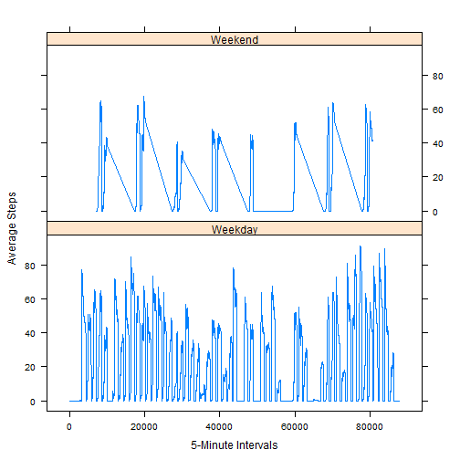

It is now possible to collect a large amount of data about personal movement using activity monitoring devices such as a Fitbit, Nike Fuelband, or Jawbone Up. These type of devices are part of the "quantified self" movement - a group of enthusiasts who take measurements about themselves regularly to improve their health, to find patterns in their behavior, or because they are tech geeks. But these data remain under-utilized both because the raw data are hard to obtain and there is a lack of statistical methods and software for processing and interpreting the data. Today we'll look at some activity monitoring data.

After downloading the data from https://d396qusza40orc.cloudfront.net/repdata_data_activity.zip, we load the data.


```r
amd <- read.csv('activity.csv')
amd$date <- as.Date(amd$date)
summary(tapply(amd$steps, amd$date, sum))
```

```
##    Min. 1st Qu.  Median    Mean 3rd Qu.    Max.    NA's 
##      41    8840   10800   10800   13300   21200       8
```

Now that the data is loaded let's see the distribution of the data.

 

Now let's see the average activity over time.


```r
amd <- amd[!is.na(amd$steps),]
avgsteps <- tapply(amd$steps,amd$interval,mean)
```

 

Now let's see which 5-minute interval had the most steps on average.


```r
amd$interval[max(tapply(amd$steps, amd$interval, mean))]
```

```
## [1] 1705
```

After poking through the data, you will noticed there are quite a few missing values.


```r
mydf <- read.csv('activity.csv')
mydf$date <- as.Date(mydf$date)
missingvalues <- mydf[is.na(mydf$steps),]
nrow(missingvalues)
```

```
## [1] 2304
```

To replace the missing values let's set them equal to the average number of steps up to that interval for that day.


```r
missingvalues <- is.na(mydf$steps)

mydf$steps[is.na(mydf$steps)] <- 0
for (i in 1:nrow(mydf)) {
  if (mydf$interval[i] == 0) {
    counter = 1
    sum = mydf$steps[i]
    mydf$avgsteps[counter] = sum
  }
  else {
    counter = counter + 1
    sum = sum + mydf$steps[i]
    mydf$avgsteps[i] = sum / counter
  }
}

mydf$steps[missingvalues] <- mydf$avgsteps[missingvalues]

summary(tapply(mydf$steps, mydf$date, sum))
```

```
##    Min. 1st Qu.  Median    Mean 3rd Qu.    Max. 
##       0    6780   10400    9350   12800   21200
```

Here's the distribution of the processed data.

 

Let's see how it compares to the original data.


```r
summary(tapply(amd$steps, amd$date, sum))
```

```
##    Min. 1st Qu.  Median    Mean 3rd Qu.    Max. 
##      41    8840   10800   10800   13300   21200
```

 

Seems like the method to replace the missing data didn't skew the distribution too much.

Lastly let's see the differences in activity between weekdays and weekends.


```r
dayorend <- weekdays(mydf$date)

dayorend[weekdays(mydf$date) != c('Saturday','Sunday')] <- 'Weekday'
dayorend[weekdays(mydf$date) == c('Saturday','Sunday')] <- 'Weekend'

mydf[,'dayorend'] <- dayorend
mydf[,'plottingint'] <- sapply(1:nrow(mydf), function(x) (x-1)*5)
```

 
